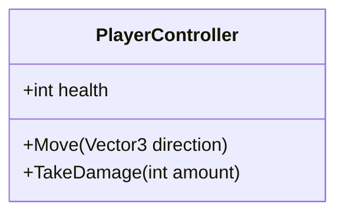

# Unity代码解析与文档生成框架

## 1. 目标
- 自动解析Unity C#代码、Shader代码以及其他语言的代码，提取类、方法、属性、Shader Pass等信息。
- 生成对应的Markdown文档和Mermaid流程图。

## 2. 功能模块

### 2.1 代码解析模块
- **输入**：Unity C#代码文件路径、Shader文件路径以及其他语言的代码文件路径。
- **功能**：
  - 解析C#代码文件，提取类、方法、属性、字段等信息。
  - 解析Shader代码文件，提取Shader Pass、Properties、SubShader等信息。
  - 解析其他语言的代码文件，提取关键信息（如函数、类、模块等）。
  - 识别类之间的关系（继承、实现接口等）。
  - 识别方法调用关系。
- **输出**：结构化数据（如字典、列表等），包含代码的元信息。

### 2.2 Markdown生成模块
- **输入**：代码解析模块生成的结构化数据。
- **功能**：
  - 根据提取的代码信息生成Markdown文档。
  - 包括类、方法、属性、Shader Pass等的详细描述。
  - 支持代码块的语法高亮。
- **输出**：Markdown文件（`.md`）。

### 2.3 Mermaid生成模块
- **输入**：代码解析模块生成的结构化数据。
- **功能**：
  - 生成Mermaid流程图，展示类之间的关系和方法调用流程。
  - 支持类图（Class Diagram）和时序图（Sequence Diagram）。
- **输出**：Mermaid代码块，嵌入到Markdown文件中。

### 2.4 主程序模块
- **功能**：
  - 协调代码解析、Markdown生成和Mermaid生成模块。
  - 处理命令行参数（如输入文件路径、输出目录等）。
  - 提供日志记录和错误处理。
- **输出**：最终的Markdown文件，包含Mermaid流程图。

### 2.5 多语言处理模块
- **功能**：
  - 支持解析Unity Shader代码，提取Shader Pass、Properties、SubShader等信息。
  - 支持扩展其他代码语言的解析（如JavaScript、Python、C++等）。
  - 根据文件扩展名自动选择相应的解析器。
  - 提供语言无关的通用接口，便于扩展新的语言支持。
- **输出**：结构化数据，包含多语言代码的元信息。

## 3. 文件结构
```
unity_code_parser/
├── parser/
│   ├── base_parser.py       # 解析器基类
│   ├── csharp_parser.py     # C#代码解析器
│   ├── shader_parser.py     # Shader代码解析器
│   ├── python_parser.py     # Python代码解析器
│   ├── javascript_parser.py # JavaScript代码解析器
│   └── cpp_parser.py        # C++代码解析器
├── generator/
│   ├── markdown_generator.py  # Markdown生成模块
│   └── mermaid_generator.py   # Mermaid生成模块
├── main.py                  # 主程序模块
└── README.md                # 项目说明文档
```

## 4. 示例输出

### 4.1 Markdown示例
```markdown
# Class: PlayerController (C#)

## Properties
- `health`: int - The player's health.

## Methods
- `Move(direction: Vector3)`: void - Moves the player in the specified direction.
- `TakeDamage(amount: int)`: void - Reduces the player's health by the specified amount.

# Shader: ExampleShader

## Properties
- `_MainTex`: Texture2D - The main texture.

## SubShader
- Pass "ExamplePass"
  - Vertex Shader: ExampleVertexShader
  - Fragment Shader: ExampleFragmentShader

# Python: ExampleModule

## Functions
- `calculate_sum(a: int, b: int)`: int - Returns the sum of two integers.

# JavaScript: ExampleComponent

## Properties
- `count`: number - The current count.

## Methods
- `increment()`: void - Increases the count by 1.
```

### 4.2 Mermaid示例


## 5. 下一步计划
1. 实现C#代码解析模块，支持基本类和方法提取。
2. 实现Shader代码解析模块，支持Shader Pass和Properties提取。
3. 实现多语言代码解析模块，支持Python、JavaScript等语言的解析。
4. 实现Markdown生成模块，生成初步文档。
5. 实现Mermaid生成模块，支持类图和时序图。
6. 集成主程序模块，支持命令行操作。
7. 添加新语言支持的扩展机制。